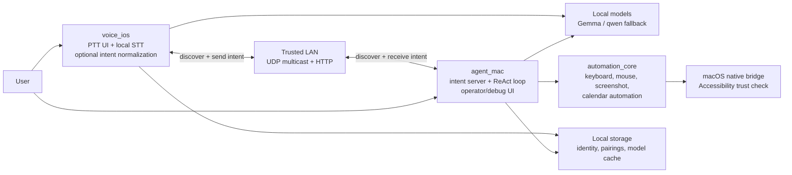

# System Design

Status: derived from the current code in the active Flutter workspace as of 2026-04-19. This document describes the implemented system, not an aspirational roadmap.

## 1. Purpose

This repo is a LAN-paired voice agent demo:

- `apps/voice_ios` runs on iPhone or the iOS Simulator, captures push-to-talk audio, transcribes it locally, optionally cleans up the spoken intent with a small local LLM, and forwards the intent to a Mac.
- `apps/agent_mac` runs on macOS, receives the intent over the local network, executes a local ReAct-style tool loop, and drives desktop automation.

The design goal is local-first execution with a very small amount of infrastructure:

- no cloud orchestration service
- no remote task queue
- no central backend for request routing
- local inference and local automation after model assets are available

Regular mode may still download model artifacts from Hugging Face or the Cactus registry. Demo mode avoids that by preloading a fixed model into known paths.

## 2. Scope And Active Code

The active runtime path is the workspace declared in the root [`pubspec.yaml`](/Users/andywang/voice-agents-hack-flutter/pubspec.yaml):

- `apps/voice_ios`
- `apps/agent_mac`
- `packages/agent_protocol`
- `packages/agent_llm`
- `packages/lan_transport`
- `packages/automation_core`
- `packages/cactus_patched`

Two parts of the repo are important context but not part of the hot path:

- `ref/`: upstream/reference apps and libraries used as source material
- `packages/localsend_common`: vendored LocalSend-related code that is not currently imported by the active apps

## 3. High-Level Architecture

## 4. Architectural Decisions

### Split the system by capability, not symmetry

The phone is optimized for capture and forwarding. The Mac is optimized for automation.

- iPhone responsibilities: recording, transcription, lightweight normalization, peer discovery, intent forwarding
- Mac responsibilities: trust gate, full tool loop, desktop automation, calendar integration

This keeps the phone simpler and puts risky side effects on the device the user is actively supervising.

### Keep inference local once assets exist

Both apps use the shared `agent_llm` package and a patched `cactus` SDK wrapper. The repo prefers local models over remote APIs:

- STT uses Gemma-4 audio transcription via Cactus
- phone tier prefers `gemma-4-e2b-it`
- desktop tier prefers `gemma-4-e4b-it`
- desktop can fall back to the sibling Gemma spec
- desktop ultimately falls back to `qwen3-1.7`
- iOS is pinned to `gemma-4-e2b-it` and fails loudly if that model cannot be used

### Reuse LocalSend conventions where helpful

The LAN layer is inspired by LocalSend and keeps its multicast group, port, and info endpoint:

- UDP multicast group: `224.0.0.167`
- shared port: `53317`
- info endpoint: `/api/localsend/v2/info`

But intent execution uses a custom application endpoint:

- `POST /agent/v1/intent`

### Treat the LAN as trusted but still require pairing

The transport is plain HTTP on the local network. There is no TLS or mutual auth in the MVP. Instead, the design uses:

- a stable per-install fingerprint
- explicit approval for first-time inbound peers on the Mac
- a persisted allowlist in local storage

This is intentionally lightweight, but it assumes a trusted local network.

## 5. Package Responsibilities

| Package/App | Responsibility |
| --- | --- |
| `apps/voice_ios` | iOS UI, push-to-talk, local STT, optional intent normalization, discovery, manual peer add, intent forwarding |
| `apps/agent_mac` | macOS UI, HTTP server, pairing approval UI, local ReAct loop, automation dispatch |
| `packages/agent_protocol` | wire-level request/response DTOs and tool trace objects |
| `packages/lan_transport` | device identity, pairing store, multicast discovery, HTTP client/server |
| `packages/agent_llm` | model bootstrap, Hugging Face download/install, demo-mode path resolution, STT bootstrap, ReAct loop, recorder |
| `packages/automation_core` | tool schemas plus the macOS automation surface |
| `packages/cactus_patched` | vendored Cactus SDK with a direct `modelPath` initialization path for pre-extracted models |

## 6. Runtime Components

### 6.1 `voice_ios`

`IosCore` is the main application controller.

Responsibilities:

- load or create a stable device identity
- start multicast discovery
- expose a preferred peer selection policy
- record WAV audio at 16 kHz mono
- load Gemma STT and transcribe locally
- optionally run a one-shot local LLM tool call to normalize the intent
- send the final intent to the Mac over HTTP

Important behavior:

- The app does not host an intent server.
- `LanAgentClient` is created with `acceptsIntents: false`, so the phone is a send-only peer.
- If an LLM is not loaded on iOS, the app forwards the raw transcript.
- On successful response from the Mac, the phone trusts that peer locally so it is preferred later.

### 6.2 `agent_mac`

`AgentCore` is the main application controller.

Responsibilities:

- load identity and persisted pairings
- host `LanAgentServer`
- start multicast discovery and show local IPs
- initialize macOS automation readiness
- bootstrap the desktop LLM and STT
- run the ReAct tool loop for inbound or locally-entered intents

Important behavior:

- The Mac is the only side that executes real automation.
- The app can run intents locally from its own debug UI without involving the phone.
- If no model is loaded, inbound requests fail fast with `errorCode: not_ready`.
- There is a simple hard-coded fast path for Spotlight commands that bypasses the model and dispatches `cmd+space` directly.

### 6.3 `lan_transport`

This package provides the peer-to-peer control plane.

Core concepts:

- `DeviceIdentity`: stable alias + random fingerprint stored in `SharedPreferences`
- `LanPeer`: discovered or trusted peer record
- `PairingStore`: JSON allowlist in application support
- `MulticastService`: announce/listen over UDP every 5 seconds
- `LanAgentServer`: HTTP server on the Mac
- `LanAgentClient`: HTTP client on both apps

Protocol details:

- Discovery packets are small JSON messages with alias, fingerprint, port, device type, version, and `acceptsIntents`.
- Intent requests are JSON `IntentRequest` objects.
- Responses are JSON `IntentResponse` objects plus optional `ToolCallTrace` entries.
- The client identifies itself with `x-lan-*` headers.

### 6.4 `agent_llm`

This package is the shared local AI runtime wrapper.

Key services:

- `LmBootstrap`: choose model, resolve runtime profile, ensure model assets exist, initialize Cactus
- `SttBootstrap`: provision and initialize Gemma-4 for transcription
- `ReactLoop`: small bounded ReAct executor
- `MicRecorder`: simple WAV recorder
- `hf_downloader.dart`: direct Hugging Face installer for Gemma int4 weights

Notable design choices:

- `CactusLM(enableToolFiltering: false)` is used, so the Mac always gets the full tool list rather than filtered tools.
- Runtime profile affects context sizes:
  - desktop: `4096 -> 2048 -> 1024`
  - iPhone: `1024 -> 512 -> 256`
  - iOS Simulator: `512 -> 256`
- Gemma installs are validated and cached with marker files such as `.cactus-ready`.
- Rejected model versions are also marked so the installer can skip known-bad artifacts until compatibility changes.

### 6.5 `automation_core`

This is the execution plane for macOS actions.

Implemented capabilities:

- `captureScreenshot`
- `moveMouse`
- `clickMouse`
- `typeText`
- `pressKeys`
- `wait`
- `createCalendarEvent`

Stubbed or intentionally incomplete in the MVP:

- `detectElementPosition`
- `getShortcuts`
- `askUser`

The design therefore prefers keyboard shortcuts and deterministic automation over vision-heavy flows.

### 6.6 `cactus_patched`

This vendored package is important because it enables the repo's main model-loading strategy.

The patch adds support for:

- `CactusInitParams.modelPath`
- `CactusInitParams.quantization`

That allows the app to initialize directly from a pre-extracted model directory instead of being forced through the default slug-to-documents-path and registry lookup flow.

## 7. End-To-End Flows

### 7.1 Bootstrap And Discovery

1. Each app loads or creates a stable identity.
2. Each app starts UDP multicast on port `53317`.
3. The Mac also starts an HTTP server on `0.0.0.0:53317`.
4. Peers exchange multicast JSON announcements every 5 seconds.
5. The phone ranks discovered peers, preferring trusted desktop peers that accept intents.

### 7.2 First Contact And Pairing

1. The phone sends `POST /agent/v1/intent` with `x-lan-*` identity headers.
2. The Mac compares the caller fingerprint to its `PairingStore`.
3. If the fingerprint is unknown, the Mac shows a pairing approval dialog.
4. If approved, the peer is persisted and the intent is processed.
5. When the phone gets a successful response, it also persists trust for that Mac locally.

This means pairing is initiated implicitly by the first successful command attempt.

### 7.3 Voice Command Execution

1. The user holds the push-to-talk button on iOS.
2. `MicRecorder` writes a temporary WAV file.
3. `SttBootstrap` transcribes the file with local Gemma-4.
4. If an iOS LM is loaded, `voice_ios` asks it to call `forward_to_mac(intent)` and extracts the cleaned imperative form.
5. The phone sends `IntentRequest` to the Mac.
6. The Mac checks readiness:
   - no model loaded: fail fast
   - fast-path match: execute directly
   - otherwise: run `ReactLoop`
7. `ReactLoop` alternates between model output and tool dispatch, recording a tool trace.
8. The Mac returns `IntentResponse`.
9. The phone shows the final text and keeps the response trace available in the payload.

### 7.4 Local Mac Testing Flow

The Mac UI can run an intent locally by constructing an `IntentRequest` and pretending the sender is a loopback desktop peer. This keeps development unblocked even without a phone.

### 7.5 Demo Mode Flow

Demo mode is controlled by:

- `VOICE_AGENT_DEMO_MODE=true`
- `VOICE_AGENT_DEMO_ROOT=/absolute/path/to/.demo-models`

Flow:

1. `preload_gemma_demo.command` runs workspace `pub get` and prepares `gemma-4-e2b-it` in `.demo-models`.
2. `run_gemma_demo.command` builds both apps with the demo defines.
3. `agent_mac` loads Gemma from `<demo-root>/gemma-4-e2b-it`.
4. `voice_ios` loads Gemma from its simulator sandbox copy under `Library/Application Support/gemma4_demo/gemma-4-e2b-it`.
5. In demo mode there is no sibling fallback and no `qwen3-1.7` fallback. Missing or invalid preload is a hard failure.

## 8. Data Model And Storage

### 8.1 Wire DTOs

`agent_protocol` defines the shared contract:

- `IntentRequest`
  - `correlationId`
  - `text`
  - `sourceDevice`
  - `createdAtMs`
- `IntentResponse`
  - `correlationId`
  - `success`
  - `text`
  - `trace`
  - optional `errorCode`
- `ToolCallTrace`
  - `toolName`
  - `args`
  - `result`
  - `ms`

### 8.2 Local Persistence

| Data | Location |
| --- | --- |
| device alias + fingerprint | `SharedPreferences` |
| trusted peers | `<app support>/lan_pairings.json` |
| downloaded Gemma weights | `<app support>/gemma4_weights/<slug>` |
| preloaded demo weights on host | `<repo>/.demo-models/<slug>` |
| preloaded demo weights in simulator | `<sim app support>/gemma4_demo/<slug>` |
| temporary audio recordings | app temp directory |
| last screenshot | in-memory only |

## 9. Security, Reliability, And Constraints

### Security

- Transport is plaintext HTTP on the LAN.
- Trust is fingerprint-based allowlisting, not cryptographic identity verification.
- macOS automation is gated by Accessibility permission.
- Calendar automation requires Apple Events / Calendar permissions on macOS.

### Reliability

- The ReAct loop is bounded to 8 steps.
- Tool traces are returned to aid debugging.
- Input automation returns structured error codes if initialization or Accessibility trust is missing.
- The Mac shows local IPs because iOS Simulator multicast does not cross the simulator boundary reliably.

### Current MVP Limitations

- Vision-based UI element detection is stubbed.
- Shortcut retrieval is stubbed.
- Interactive `askUser` tool calls are stubbed.
- There is no background service or always-on daemon model; both apps are foreground Flutter apps with debug/operator UIs.
- The Mac must have a model loaded before it can service requests.

## 10. Testing Posture

Current automated coverage is mostly unit-level:

- `apps/agent_mac/test/intent_handling_test.dart`
  - spotlight fast-path matching
  - zero-trace diagnostic behavior
- `packages/automation_core/test/automation_service_test.dart`
  - automation readiness gating
  - accessibility-denied behavior
- `packages/agent_llm/test/lm_bootstrap_test.dart`
  - runtime-profile context ladders
  - fallback behavior
  - demo-mode path behavior
- `packages/agent_llm/test/hf_downloader_test.dart`
  - cache marker and version selection behavior

What is missing today:

- end-to-end tests across iOS -> LAN -> macOS
- fault-injection around pairing and networking
- automation integration tests against real macOS permissions and UI state

## 11. Summary

The repo is a local-first, two-device voice automation system built around three core ideas:

1. keep capture on the phone and side effects on the Mac
2. use a minimal peer-to-peer LAN protocol instead of a backend
3. run local models through a shared Cactus-based stack with a patched direct-model-path loader

That makes the current system easy to demo and easy to reason about, while still leaving clear seams for future hardening around transport security, richer automation tools, and deeper end-to-end testing.
